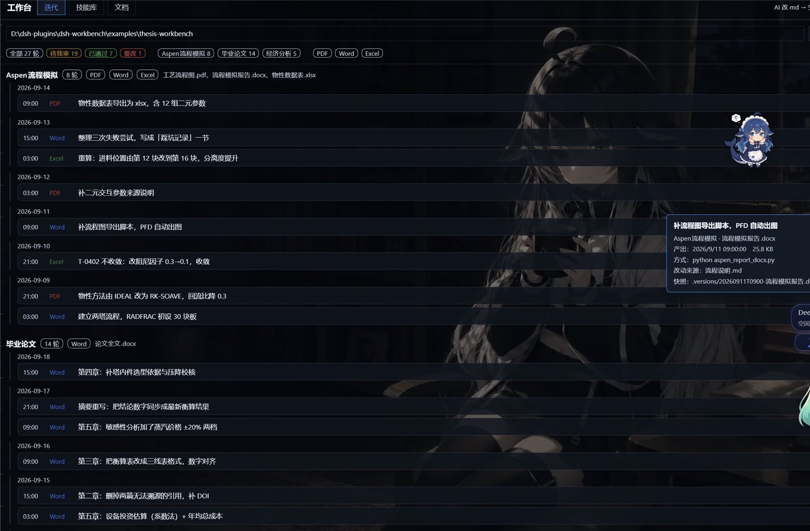

# dsh-workbench

> 给 [DeepSeek Harness](https://github.com/deepseek-ai/deepseek-harness) Web 端加一个「工作台」面板：
> **迭代**（AI 改 md → 生成 Word → 你审这一版，一条时间轴看全）、
> **技能库**（看机器上所有技能、读全文）、
> **文档**（md 源与 docx/pdf 产物配对，把「产物比源旧」挑到最前面）。

DSH Web 插件 · 零依赖 · 只读为主（唯一的写是记审批）· 左栏一个图标，主区域一个面板。

---

## 它解决什么

**一、AI 把文档迭代得像代码，但你看不见这条线。**
AI 改 30 次 `.md`，每次生成一份 Word 给你 —— 中间那些版本**全部同名覆盖，消失了**；
你看到永远只有最新一版，也不知道这版跟前一版差在哪。

**二、技能散在好几个地方，看不见也搜不到。**
一个 DSH 技能可能来自项目层（`.agents/skills`）、用户层（`~/.agents/skills`）、内置层……想知道
「我到底装了哪些技能、那个技能到底写了什么」，得挨个目录翻。

**三、用 AI 改文档时，源和产物会脱节。**
Markdown 是源，docx/pdf 是产物。改完 md 忘了重新生成 → 交出去的 Word 里是旧内容。

这个插件把这三件事放进同一个面板。

## 界面

点左栏的「工作台」图标，主区域出现面板，三个页签：

### 迭代（默认）

把「AI 改文档」这件事变成一条看得见的时间轴：

- 按**产线**分组（毕业论文 / Aspen 流程模拟 / 经济分析…），产线内**按天分小节**，一轮一行；
- 每轮显示：时间、产物类型（Word / PDF / Excel）、**这一版干了什么**、改自哪几个 md、审批状态；
- **鼠标悬停**任一版 → 浮出摘要卡：摘要、产出时间与体积、生成方式（哪条命令）、改动来源、快照路径、你的历史意见；
- 点开一轮 → 【通过】【要改】【重置为待审】，写进记录文件；
- 顶部按状态（待我审 / 已通过 / 要改）、产线、类型筛选。

**「载入演示」** 一键加载插件自带的假数据（`examples/thesis-workbench/`，3 条产线 27 轮），
先看效果再决定要不要用。



*截图里是插件自带的演示项目，内容全是假数据；右侧浮层是鼠标悬停在某一轮上时的摘要卡。*

### 记录格式

时间轴不是猜出来的，是**产出那一刻记下来的**。每个产线目录下：

```
产线/
├── *.md                        ← 源（AI 改的就是这些）
├── 论文全文.docx                ← 工作副本，名字永远不变（每次覆盖）
└── .versions/
    ├── produced.jsonl          ← 产出记录：追加一行一条
    ├── decisions.jsonl         ← 你的审批：追加一行一次
    └── 20260911T2210-论文全文.docx   ← 快照（这才叫版本存在）
```

`produced.jsonl` 一行：

```json
{"id":"20260911T2210-毕业论文-3","at":1789000200000,"line":"毕业论文",
 "artifact":"论文全文.docx","snapshot":".versions/20260911T2210-论文全文.docx",
 "kind":"docx","bytes":38000,"tool":"python thesis_docx.py","by":"dsh",
 "sources":[{"path":"03-第三章-物料衡算.md"}],
 "summary":"第3章：修正乙苯转化率 0.62→0.58，重算全表"}
```

`decisions.jsonl` 一行：

```json
{"id":"20260911T2210-毕业论文-3","at":1789007400000,"state":"rejected","by":"liyadong","note":"热量衡算和物料衡算对不上"}
```

`state` ∈ `approved` / `rejected` / `pending`；同一个 id 以**最后一条**为准（追加式，不改历史）。

工作模式就是这条循环：

```
AI 改 .md  →  跑脚本生成 docx/pdf/xlsx  →  写 produced.jsonl + 存快照
   ↑                                                    ↓
   └────── 你给反馈 ←── 你在插件里审 Word ←──────────────┘
```

### 技能库

- 列出**模型实际会加载的那份技能目录**（走核心 `ctx.skills` 注册表，不另建索引，不会漂移）
- 按技能名 / 描述 / 触发词搜索，按来源过滤（用户 · `.agents`、内置、项目层…）
- 点任意一条，右侧显示它的 `SKILL.md` 全文与来源路径

### 文档

- 填一个目录（或用下拉里的已登记工作区），扫描
- 按主干名把 md/tex/qmd 等**源**与 docx/pdf/xlsx 等**产物**配对
- 状态从「该先处理」往下排：

| 徽章 | 含义 |
|---|---|
| 🔴 产物过期 | 产物比源旧 —— 改过 md 却没重新生成 |
| 🟠 无源产物 | 只有产物没有同名源（历史遗留） |
| ⚪ 未生成产物 | 源还没有对应产物 |
| 🟢 已同步 | 产物不比源旧 |

## 安装

```sh
# 从本仓库源码安装（link: 方式，改源码只需重启宿主）
dsh plugin --profile web add link:/绝对路径/dsh-workbench

# 或从 GitHub 源码入口安装
dsh plugin --profile web add github:liiydong/dsh-workbench
```

装完**必须重启 `dsh web`**：客户端 bundle 在组合阶段被快照进内存，刷新页面不够。

### 工作台出现在哪里

| 落点 | 出现在哪 | 条件 |
|---|---|---|
| 官方左栏面板座位 | 系统左栏的面板图标行（`sidebar.panellist` + `main`） | 总是注册 |
| 侧栏页签 | 若你装了 `dsh-better-sidebar`，工作台也会作为它的一个页签出现 | 装了才注册 |

两条路互不影响，注册都挂在插件 fiber 上，卸载即消失。`dsh-better-sidebar` 是**可选**依赖：
读不到（`ctx.get('betterSidebar')` 返回 undefined）就只走官方座位，不报错、也不会让插件挂起。

> **和「文件变动」的关系**：做的过程中发现侧栏里已经有一个「文件变动」，它看的是
> 「这次会话里 AI 碰过哪些文件」；「迭代」页想要的比这多一层 —— **跨会话、跨天、跨产线**的版本线，
> 每一版带着摘要、快照路径和你审批的状态。所以这块是在它旁边做的派生，工作台同时也注册成了
> `dsh-better-sidebar` 的一个页签，两者在同一个入口里并存。

卸载：

```sh
dsh plugin --profile web remove dsh-workbench
```

## 它怎么拿到数据

宿主半侧只有 7 条 JSON 路由，全部在 `/api/dsh-workbench/` 下：

| 路由 | 方法 | 数据来源 |
|---|---|---|
| `/skills?cwd=` | GET | `ctx.skills.snapshot()` —— 核心技能注册表 |
| `/skill?name=&cwd=` | GET | `ctx.skills.get()` —— 单个技能全文 |
| `/docs?dir=` | GET | `node:fs/promises` 扫目录 + 源产物配对 |
| `/workspaces` | GET | `ctx.workspaceRegistry.list()` —— 目录下拉 |
| `/history?dir=` | GET | 读各产线的 `.versions/produced.jsonl` + `decisions.jsonl` |
| `/demo` | GET | 插件自带演示项目的绝对路径 |
| `/decide` | POST | **唯一的写操作**：往 `<产线>/.versions/decisions.jsonl` 追加一行审批 |

写路径做了越界检查（只允许写根目录的直接子目录，拒绝 `..`、分隔符与非法状态）。
除此之外**不写任何文件，不发任何模型调用，不采集遥测**。

## 开发

```
dsh-workbench/
├── package.json          # dsh.bundle.patch + dsh.client.platform + dsh.engines.dsh
├── cordis.patch.yml      # 把宿主行插进 profile 名册
├── lib/
│   ├── index.js          # 宿主半侧：7 条路由（ESM，零依赖）
│   └── client.js         # 浏览器半侧：侧栏图标 + 三个页签（手写 __ModuleLoader__ bundle，无构建步骤）
├── examples/
│   ├── make-demo.mjs     # 生成演示项目（假内容、真结构）
│   └── thesis-workbench/ # 演示数据：3 条产线 27 轮
└── test/
    ├── smoke.mjs         # 组件树自检：桩 __ModuleLoader__ + 迷你 React，60 项
    └── host-routes.mjs   # 路由自检：假 req/res + 真实文件系统扫描 + 真写一次审批，46 项
```

```sh
node test/smoke.mjs
node test/host-routes.mjs          # 可选参数：/docs 要扫描的目录
node examples/make-demo.mjs        # 重新生成演示数据
```

两套自检都**不需要浏览器**：客户端 bundle 的 `factory` 与组件都是普通函数，在 Node 里可直接跑
（迷你 React 运行时按组件实例分配 hook 槽、按「组件类型 + hook 序号」去重 effect、在渲染循环里展开整棵树）。
`host-routes.mjs` 还会在系统临时目录里真写一次审批，验证「追加一行 → 再读就变了」这条回路。
抓得到崩溃与状态流转错误，抓不到布局观感。

## 已知限制

- 界面观感只过了组件树自检，**未做人工视觉验证**；浅色/深色都做了适配但与真实主题的贴合度可能还要调。
- **记录要靠产出方写。** 插件只负责显示 `.versions/produced.jsonl` 里有的东西 ——
  谁来写？目前是产出文件的那一方（AI 跑脚本时、或你的导出脚本里）追加一行。
  插件本身不会去猜"这个文件是什么时候被谁生成的"：猜出来的摘要不如没有。
- 历史上已经同名覆盖掉的版本，**找不回来**（快照是从设了记录器之后才开始存的）。
- 「产物过期」按**文件修改时间**判定，不看内容。生成脚本若先 touch 产物再写内容，判定会偏乐观。
- 目录扫描不递归，只扫一层；一次最多返回 1000 轮。
- 审批写的是记录文件，**不会**真的去改动或回滚你的 Word。

## 关于这个仓库：作者与 AI 披露

- 本仓库的代码由 **DeepSeek Harness 中的 AI Agent 生成**，由仓库所有者审阅、验证并发布；
  每次提交的验证方式记录在 `CHANGELOG.md`（不需要浏览器的两套自检，共 115 项）。
- **演示数据全是编的**（`examples/thesis-workbench/`，3 条产线 27 轮），不含任何真实文档或个人信息；
  仓库里不含本机路径、姓名或邮箱，提交作者统一使用 GitHub 的 noreply 邮箱。
- 以 **MIT** 发布（见 `LICENSE`）。
- 第三方接口说明：与 `dsh-better-sidebar` 的集成使用它**公开的**客户端服务契约
  （`ctx.betterSidebar.registerTab`），未复制其代码。该契约按其文档是版本化的（`SIDEBAR_FEATURES`），
  所以本插件把它当作**可选**依赖：读不到就只走官方座位。

## License

MIT
